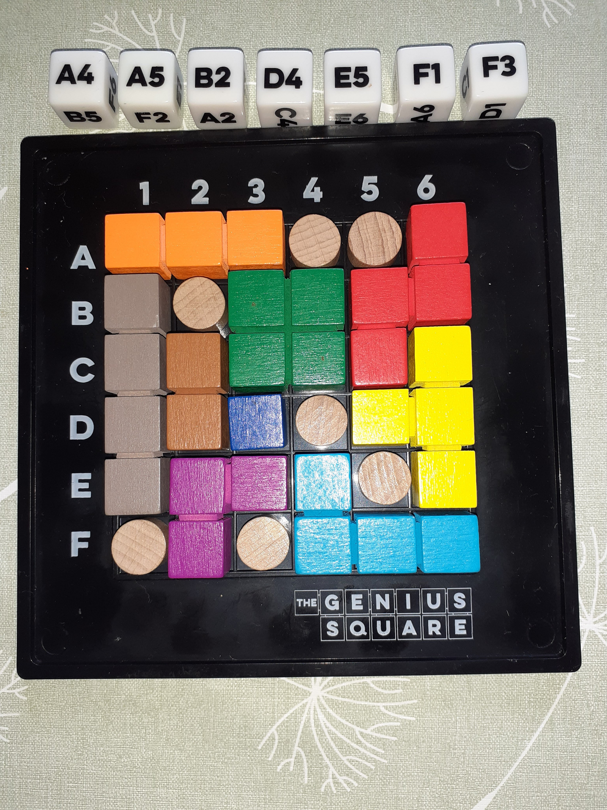

# rotating_shapes

Consider this board:

Given a board size of rectangular shape and the positions of the stumpers (brown, circular objects) and the shape of each of the coloured shapes:  
* rotating_shapes.m finds all the possible ways that the shapes can be arranged to fit around the stumpers.

shapes.csv defines the shapes of each of the coloured shapes.  
* a 1 in shapes.csv defines a single block of a shape.
* a 2 in shapes.csv defines the boundary between adjacent shapes.  

In rotating_shapes.m the stumpers array is of size nx2. It contains the x, y co-ordinates of the positions of the stumpers.  
* You can change the board_width and board_height variables as desired.  

rotating_shapes.m is made up of three functions:  
1. shapes_to_placements
2. find_solutions
3. plot_figures

Each of the three functions can be run in turn inside of the rotating_shapes.m script.

